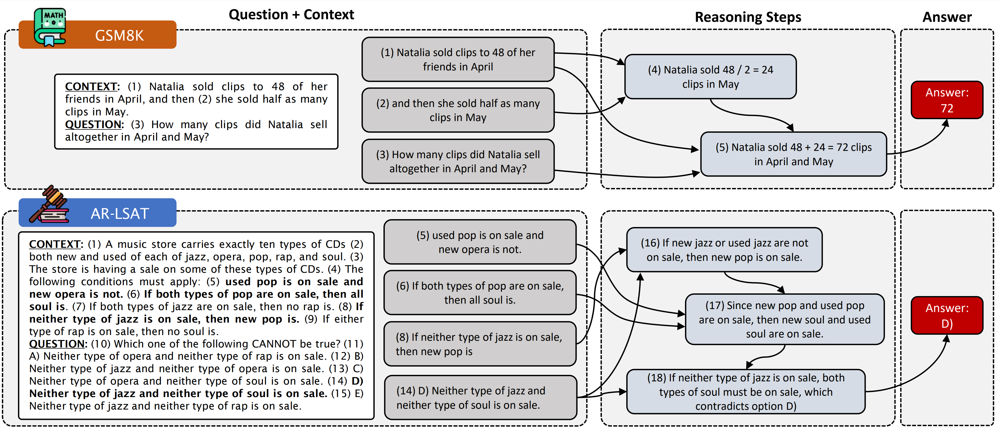

# STREET: a Multi-Task Structured Reasoning and Explanation Benchmark

<!--  -->


# Running Geneartion Script

This repository contains the annotations and script to generate the data for the STREET dataset.

Requirements: 

* Python 3

Execute the following python script:

```
python run_street_data_generation.py
```

The script will download some of the original datasets in which STREET is built and merge them with our reasoning and explanation annotations.

The final data will be contained within the `./data/$STREET_TASK$/reasoning_annotated_$SPLIT$.jsonl` files in JSONL format.


# Citation

```
@inproceedings{
    ribeiro2023street,
    title={{STREET}: A {MULTI}-{TASK} {STRUCTURED} {REASONING} {AND} {EXPLANATION} {BENCHMARK}},
    author={Danilo Neves Ribeiro and Shen Wang and Xiaofei Ma and Henghui Zhu and Rui Dong and Deguang Kong and Juliette Burger and Anjelica Ramos and zhiheng huang and William Yang Wang and George Karypis and Bing Xiang and Dan Roth},
    booktitle={International Conference on Learning Representations},
    year={2023},
    url={https://openreview.net/forum?id=1C_kSW1-k0}
}
```